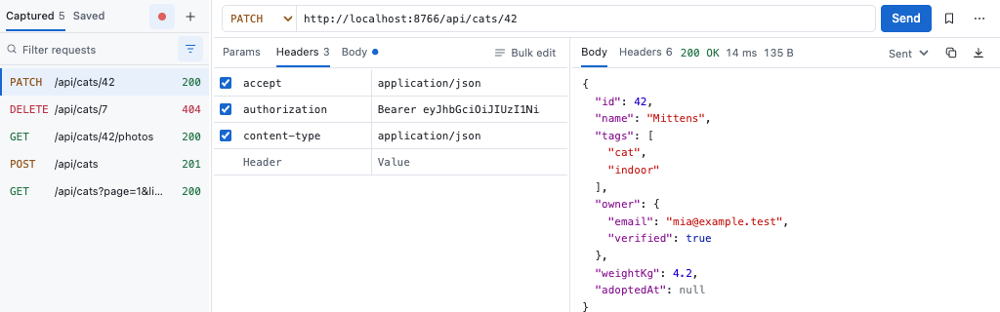
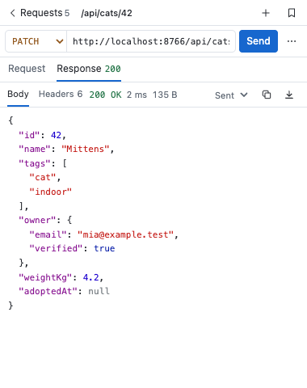

# Postcat

[](https://github.com/maphel/Postcat/actions/workflows/check.yml)

A small Postman inside Chrome DevTools. Postcat records the requests of the page you are
inspecting, lets you edit and resend them, and keeps the ones you need in a collection.





The same two views in the dark appearance: [bottom](docs/screenshot-dark.png), [side](docs/screenshot-side-dark.png).

- **Capture** – every request of the inspected tab, with its response body. "Import log" adds
  what DevTools recorded before the panel was opened.
- **Edit** – method, URL, query params (table), headers (table or bulk text), body with live
  JSON validation. Paste a cURL command to import it; copy any request as cURL.
- **Send** – from the extension, so CORS does not apply and headers like `Cookie`, `Origin` or
  `User-Agent` can be set. Compare the recorded response with the new one.
- **Inspect** – JSON with syntax colours, images, SVG, video, audio, PDF, fonts, HTML (sandboxed),
  hex for anything else. Search with ⌘F, save the body as a file.
- **Keep** – a saved collection with autosave and undo.

Works in Chrome, Brave and other Chromium browsers (version 116 or newer). Everything stays on
your machine: no backend, no telemetry (see `SECURITY.md`).

## Install

1. Download `postcat-<version>.zip` from the [latest release](https://github.com/maphel/Postcat/releases)
   and unzip it, or clone this repository.
2. Open `chrome://extensions`, enable **Developer mode**, click **Load unpacked** and pick the
   folder that contains `manifest.json`.
3. Open DevTools on any page and switch to the **Postcat** tab.

After updating the code, reload the extension on `chrome://extensions`, then close and reopen DevTools.

## Usage

**Recording** is on by default (the dot next to the Captured / Saved tabs pauses it). The options
menu (filter icon) holds the **XHR / Fetch only** switch (turn it off to record images, fonts and
documents), **Import DevTools log**, **Clear captured** and the **Appearance** setting (Light,
Dark or System, which follows DevTools' theme); its last line shows the installed version
(`Postcat 0.1.0`). The **filter** matches `METHOD url` as
plain text or `/regex/`. The **Captured** and **Saved** tabs above the list (with their counts)
switch the collection with one click.

**Editing** a captured request marks it with ● in the list; **Reset to recorded** (in the ⋯ menu
next to Send, together with Duplicate, Copy as cURL and Delete; a right-click on a list row opens
the same menu) restores the recorded version. **Save** (bookmark icon) copies it into the
collection, where changes are saved automatically; rename a saved request in the list
(double-click its row, press F2, pick **Rename** in the ⋯ or right-click menu, or use the
**Rename** offered by the Save toast; Enter commits, Escape cancels). Hover a captured row, or the
**Recorded** label in the response header, for when it was captured, its resource type and duration.
The request tabs carry one action each: **Bulk edit** / **Table view** on Headers and
**Beautify** on Body (icon only in a narrow pane).

**Sending** shows the status, timing and size. While a request runs, the button turns into
**Cancel**. Failures explain the cause (unreachable host, timeout, invalid header, offline).
Once a captured request has also been sent, **Recorded / Sent** selects the source of the
response (with a single source it is just a label); **Body** and **Headers** are tabs in the
response header and follow the selected source.

**Responses** are shown by type; **Preview / Raw** switches between the rendered view and the
source or hex dump, next to **Copy** and **Save as file**. When the response pane is too narrow
for them, these controls move into a ⋯ menu that holds only what no longer fits inline. The type
is taken from the `Content-Type` header, or sniffed from the first bytes when the header is
missing or generic.

**Docking.** The layout follows the width of the panel: wide panels show the list, the request
editor and the response side by side; medium ones keep the list and switch between **Request**
and **Response**; narrow ones (DevTools docked to the side) show either the list or the details,
with **Requests** leading back to the list. Sending in a switched layout reveals the response.

| Keys | Action |
|---|---|
| `Enter` in the URL field, `⌘/Ctrl + Enter` | Send |
| `⌘/Ctrl + S` | Save to collection |
| `⌘/Ctrl + F` | Search the response (DevTools' search bar) |
| `↑` `↓` | Move through the list |
| `/` | Focus the filter |
| `Del` / `Backspace` | Delete (undo from the toast) |

## How replay works

Requests are sent by the extension's service worker with `<all_urls>` host permission.
Headers that `fetch()` refuses to set (`Cookie`, `Origin`, `Referer`, `User-Agent`,
`Accept-Encoding`) are applied through a short-lived `declarativeNetRequest` rule that is
scoped to the exact target origin and removed after the request.

- Cookies are exactly what is in the editor. The browser's cookie jar is neither read nor
  changed; delete the `Cookie` line to send without a session.
- `Origin` is removed unless you set it, because servers often reject `chrome-extension://`.
- `Host`, `Content-Length`, `Connection`, `Sec-*` and HTTP/2 pseudo headers are managed by the
  browser and ignored. Header values must be Latin-1.
- Only `http(s)` URLs are sent. Credentials in the URL become Basic auth; repeated headers are merged.
- Bodies are read up to 50 MB; binary bodies over 25 MB are not transferred to the panel.

### Limitations

- Recording works only while DevTools is open on the tab. After a navigation, "Import log"
  only finds earlier requests if "Preserve log" is enabled in the Network panel.
- Chrome keeps no copy of responses a page reads with `fetch().blob()` or streams; Postcat
  offers to send the request again instead.
- File uploads (multipart bodies) are recorded as text and may not replay byte-exact.
- Saved requests are stored in `chrome.storage.local` in plain text, including any `Cookie`
  or `Authorization` headers. Remove headers you do not need before saving on a shared machine.
- `Set-Cookie` response headers are hidden by the Fetch API and do not show in replays.

## Development

```bash
npm install
npm run lint        # eslint
npm test            # unit tests for src/lib (node:test)
npm run test:e2e    # extension in headless Chromium with a stubbed DevTools API (Playwright)
npm run test:real   # real Chrome with real DevTools, driven over CDP
npm run check       # all of the above
npm run pack        # dist/postcat-<version>.zip
npm run stamp       # src/build-info.js (git-ignored): the panel's version line names the commit, branch and time
npm run release <version>  # release branch: version bump + changelog; `npm run release tag` after the merge
npm run screenshot  # docs/screenshot*.png for this README (bottom and side docking, light and dark)
```

When testing a branch as an unpacked extension, `npm run stamp` before reloading it turns the
version line in the options menu into `Postcat 0.1.0 · e176965 · feat/foo · 19:42` (hover for the
full commit), so you can tell whether the reload picked up the new code. The stamp never ships:
`npm run pack` leaves `src/build-info.js` out of the zip.

`manifest.json` stays in the repository root so the unpacked extension keeps its id; the code
lives in `src/` as ES modules (`src/panel/` UI, `src/lib/` pure helpers, `src/background.js`
service worker). `AGENTS.md` has the file map and the rules that keep the replay path safe;
`CONTRIBUTING.md` describes branching, the definition of done for a PR and the release flow.

## Contributing

Issues and pull requests are welcome; see `CONTRIBUTING.md`. Security reports: `SECURITY.md`.

## License

[MIT](LICENSE)
